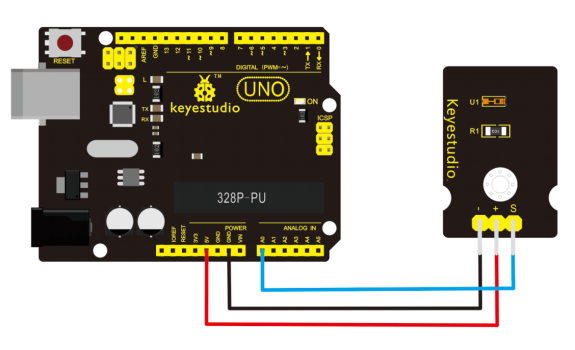
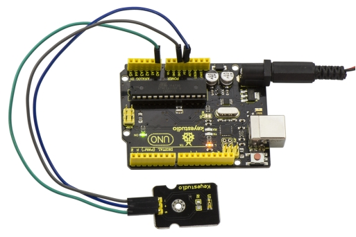

# KS0098 keyestudio TEMT6000 Ambient Light Sensor


## 1. Introduction

At some point you are going to sense ambient brightness with better precision than your trusty photoresistor without adding complexity to your project. When that day comes, go get yourself a TEMT6000 ambient light sensor.

The TEMT6000 is supposed to be adapted to the sensitivity of the human eye, but found it preformed sub-par in low light conditions.

It does however work very well reacting to very small changes in a large range of brightness. Because it is meant to mimic the human eye, it does not react well to IR or UV light, so just make sure to note that when using it in your project.

## 2. Specification

- Supply Voltage: +5VDC 50mA
- Size: 36.5*16mm
- Weight: 4g

## 3. Connection Diagram

This is an incredibly simple part, just connect power and ground, and the signal pin to your favorite analog input and you are done, the sensor will output analog voltage, that ramps up when it gets brighter. You can power this off of 3.3v as you like, the output value will just be lower.



## 4. Sample Code

Download code:  [Code](./Code.7z)

You can not get more simpler than this – This just reports the reading from the sensor to the serial terminal: 0-1023 with 1023 being very bright, and 0 being very dark.

```c
int temt6000Pin = 0;

void setup() 
{
  Serial.begin(9600);
}

void loop() 
{
  int value = analogRead(temt6000Pin);
  Serial.println(value);
  delay(100); //only here to slow down the output so it is easier to read
}
```

## 5. Result

Wiring well and uploading the code above, open the serial monitor of Arduino software.



Then cover the sensor with your hand or a paper, the light becomes weak, finally you will see the value showed on monitor decrease.

